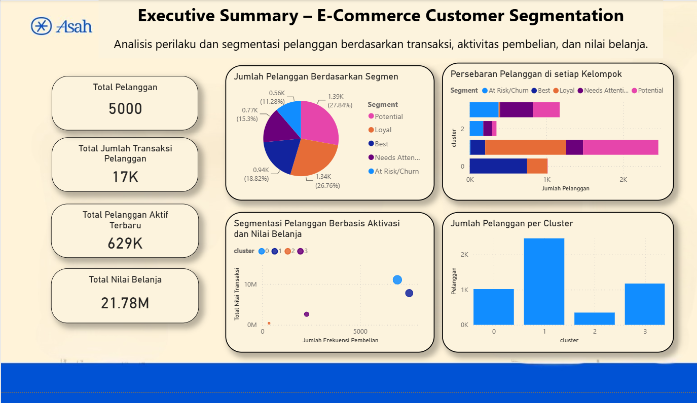

# 🛒 E-Commerce Customer Segmentation: RFM Analysis & K-Means Clustering

Repository ini berisi proyek analisis segmentasi pelanggan e-commerce menggunakan pendekatan gabungan **RFM (Recency, Frequency, Monetary)** dan algoritma **K-Means Clustering**. Proyek ini dikembangkan sebagai *capstone project* dalam program studi independen talenta digital (Asah led by Dicoding in association with Accenture).

Tujuan utama dari proyek ini adalah mengidentifikasi pola belanja pelanggan, mendeteksi potensi *churn* sejak dini, dan merancang rekomendasi strategi pemasaran berbasis data yang dapat dipersonalisasi.

---

## 📌 Business Overview & Problem Statement

Di tengah persaingan industri e-commerce yang kompetitif, biaya akuisisi pelanggan baru (*Customer Acquisition Cost*) relatif jauh lebih mahal dibandingkan menjaga retensi pelanggan yang sudah ada. 

**Tantangan Bisnis yang Dihadapi:**
1. **Kurangnya pemahaman granulitas perilaku pelanggan:** Penjualan hanya dilihat secara agregat tanpa memetakan karakteristik dan nilai unik tiap pelanggan.
2. **Keterlambatan mendeteksi risiko *churn*:** Bisnis sering kali terlambat menyadari penurunan aktivitas belanja pelanggan sebelum mereka beralih ke kompetitor.
3. **Strategi promosi yang terlalu general:** Program loyalitas atau diskon bersifat seragam (*one-size-fits-all*), sehingga efektivitas kampanye promosi menjadi rendah.

---

## 📊 Dataset & Tools

* **Sumber Data:** [E-Commerce Customer Behavior & Sales Analysis - TR (Kaggle)](https://www.kaggle.com/datasets/umuttuygurr/e-commerce-customer-behavior-and-sales-analysis-tr/)
* **Volume Data:** 17.049 transaksi dari 5.000 pelanggan unik.
* **Fitur yang Digunakan:** Metrik transaksi (`Total_Amount`, `Quantity`, `Date`), demografi, serta data aktivitas sesi (`Session_Duration_Minutes`, `Pages_Viewed`, `Is_Returning_Customer`).
* **Teknologi:** Python (Pandas, NumPy, Scikit-Learn, Matplotlib), Jupyter Notebook/Google Colab, Power BI.

---

## ⚙️ Metodologi Analisis

### 1. Data Preparation & RFM Scoring
* **Recency (R):** Jumlah hari sejak transaksi terakhir pelanggan hingga batas waktu analisis.
* **Frequency (F):** Jumlah transaksi unik yang dilakukan oleh setiap pelanggan.
* **Monetary (M):** Total nilai transaksi yang dihabiskan pelanggan.
* Setiap metrik dibagi ke dalam skala 1–5 menggunakan distribusi kuintil (`pd.qcut`), kemudian dikelompokkan ke dalam 5 segmen utama: *Best, Loyal, Potential, Needs Attention,* dan *At Risk/Churn*.

### 2. K-Means Clustering
* Menggabungkan fitur RFM dengan variabel interaksi platform (rata-rata durasi sesi, jumlah halaman yang dikunjungi, kuantitas belanja, dan status *returning customer*).
* Standarisasi fitur menggunakan `StandardScaler`.
* Penentuan klaster optimal dievaluasi menggunakan **Elbow Method** (Inertia) dan validasi **Silhouette Score** pada rentang $k = 2$ hingga $10$.

---

## 📈 Dashboard & Visualisasi

<!-- Ganti path gambar di bawah ini sesuai nama file screenshot Anda di dalam folder repository -->


Dashboard analitik interaktif yang dibangun menggunakan Power BI menyajikan:
* Ringkasan performa utama: 5.000 Total Pelanggan, 17K Transaksi, dan 21.78M Total Belanja.
* Distribusi sebaran pelanggan berdasarkan segmen RFM dan klaster K-Means.
* Visualisasi korelasi antara frekuensi transaksi terhadap nilai moneter belanja.

---

## 💡 Hasil Analisis & Rekomendasi Aksi Bisnis

| Segmen RFM | Jumlah Pelanggan | Karakteristik Perilaku | Rekomendasi Strategi Bisnis |
| :--- | :---: | :--- | :--- |
| **Best** | 941 | Frekuensi dan nilai belanja tertinggi, paling aktif bertransaksi. | Berikan *VIP treatment*, program eksklusif, dan layanan personal untuk memaksimalkan retensi (*protect high-value assets*). |
| **Loyal** | 1.338 | Rutin berbelanja dengan nilai kontribusi yang stabil. | Berikan program *loyalty reward*, *cashback*, atau poin berjenjang untuk menjaga keterikatan jangka panjang. |
| **Potential** | 1.392 | Baru bertransaksi atau aktif berkala, memiliki potensi pertumbuhan tinggi. | Terapkan strategi *cross-selling* dan penawaran berbasis minat untuk mendorong mereka naik kelas ke segmen *Loyal*. |
| **Needs Attention** | 765 | Mulai mengalami penurunan frekuensi atau jeda belanja yang semakin panjang. | Kirimkan pengingat berbasis notifikasi (*push notification/email*), rekomendasi produk relevan, dan survei kepuasan. |
| **At Risk / Churn** | 564 | Jeda transaksi sangat lama dengan nilai belanja rendah (didukung profil Cluster 2 K-Means). | Luncurkan kampanye reaktivasi (*win-back campaign*) dengan diskon khusus. Jika tidak merespons, alihkan alokasi biaya promosi ke segmen yang lebih responsif. |

---

## 📂 Struktur Repositori

```text
├── dashboard/
│   ├── Dashboard.pbix                        # File laporan Power BI
│   └── dashboard_screenshot.png              # Visualisasi dashboard untuk preview
├── notebook/
│   └── Notebook_RFM.ipynb                     # Notebook lengkap data preparation, RFM, & K-Means
└── README.md                                  # Dokumentasi proyek
